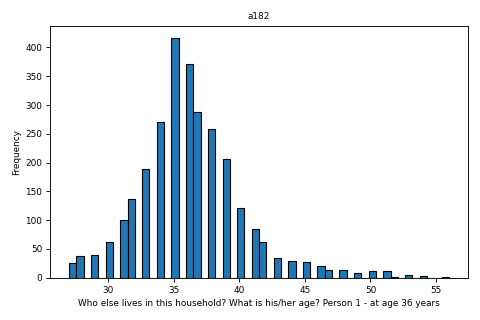

#   MRC National Survey of Health and Development  

- <a href="logout?go=home"
  style="font-weight:bold; font-family:arial; font-style:normal; font-size:0.8vw; color:#E7E5E5; text-decoration:none; display:block; padding-top:0.6em; padding-right:0.6em; padding-bottom:0.6em; padding-left:0.6em; margin:0.2em; border-radius:10px; -webkit-border-radius:10px; -moz-border-radius:10px; text-shadow:2px 2px 3px #000">Home</a>

- <a href="#"
  style="font-weight:bold; font-family:arial; font-style:normal; font-size:0.8vw; color:#E7E5E5; text-decoration:none; display:block; padding-top:0.6em; padding-right:0.6em; padding-bottom:0.6em; padding-left:0.6em; margin:0.2em; border-radius:10px; -webkit-border-radius:10px; -moz-border-radius:10px; text-shadow:2px 2px 3px #000">Search</a>
  - <a href="search?type=c&amp;id=83F012AF7522B7B8D3A1BE8DC971A3B2"
    style="font-weight:normal; font-family:Montserrat, sans-serif; font-style:normal; font-size:0.8vw; color:#424242; text-decoration:none; display:block; padding-top:0.6em; padding-right:0; padding-bottom:0.6em; padding-left:0.5em; margin:0.2em; border-radius:10px; -webkit-border-radius:10px; -moz-border-radius:10px; text-shadow:2px 2px 3px #FFF">By
    Category</a>
  - <a href="search?type=n&amp;id=83F012AF7522B7B8D3A1BE8DC971A3B2"
    style="font-weight:normal; font-family:Montserrat, sans-serif; font-style:normal; font-size:0.8vw; color:#424242; text-decoration:none; display:block; padding-top:0.6em; padding-right:0; padding-bottom:0.6em; padding-left:0.5em; margin:0.2em; border-radius:10px; -webkit-border-radius:10px; -moz-border-radius:10px; text-shadow:2px 2px 3px #FFF">By
    Variable Name</a>
  - <a href="search?type=k&amp;id=83F012AF7522B7B8D3A1BE8DC971A3B2"
    style="font-weight:normal; font-family:Montserrat, sans-serif; font-style:normal; font-size:0.8vw; color:#424242; text-decoration:none; display:block; padding-top:0.6em; padding-right:0; padding-bottom:0.6em; padding-left:0.5em; margin:0.2em; border-radius:10px; -webkit-border-radius:10px; -moz-border-radius:10px; text-shadow:2px 2px 3px #FFF">By
    Keyword</a>
  - <a href="search?type=l&amp;id=83F012AF7522B7B8D3A1BE8DC971A3B2"
    style="font-weight:normal; font-family:Montserrat, sans-serif; font-style:normal; font-size:0.8vw; color:#424242; text-decoration:none; display:block; padding-top:0.6em; padding-right:0; padding-bottom:0.6em; padding-left:0.5em; margin:0.2em; border-radius:10px; -webkit-border-radius:10px; -moz-border-radius:10px; text-shadow:2px 2px 3px #FFF">By
    Library</a>

- <a href="#"
  style="font-weight:bold; font-family:arial; font-style:normal; font-size:0.8vw; color:#E7E5E5; text-decoration:none; display:block; padding-top:0.6em; padding-right:0.6em; padding-bottom:0.6em; padding-left:0.6em; margin:0.2em; border-radius:10px; -webkit-border-radius:10px; -moz-border-radius:10px; text-shadow:2px 2px 3px #000">Baskets</a>
  - <a href="basket?command=saveNew&amp;id=83F012AF7522B7B8D3A1BE8DC971A3B2"
    style="font-weight:normal; font-family:Montserrat, sans-serif; font-style:normal; font-size:0.8vw; color:#424242; text-decoration:none; display:block; padding-top:0.6em; padding-right:0; padding-bottom:0.6em; padding-left:0.5em; margin:0.2em; border-radius:10px; -webkit-border-radius:10px; -moz-border-radius:10px; text-shadow:2px 2px 3px #FFF">Save
    Basket</a>
  - <a href="basket?id=83F012AF7522B7B8D3A1BE8DC971A3B2"
    style="font-weight:normal; font-family:Montserrat, sans-serif; font-style:normal; font-size:0.8vw; color:#424242; text-decoration:none; display:block; padding-top:0.6em; padding-right:0; padding-bottom:0.6em; padding-left:0.5em; margin:0.2em; border-radius:10px; -webkit-border-radius:10px; -moz-border-radius:10px; text-shadow:2px 2px 3px #FFF">View
    Current Basket</a>
  - <a href="previousBasket?id=83F012AF7522B7B8D3A1BE8DC971A3B2"
    style="font-weight:normal; font-family:Montserrat, sans-serif; font-style:normal; font-size:0.8vw; color:#424242; text-decoration:none; display:block; padding-top:0.6em; padding-right:0; padding-bottom:0.6em; padding-left:0.5em; margin:0.2em; border-radius:10px; -webkit-border-radius:10px; -moz-border-radius:10px; text-shadow:2px 2px 3px #FFF">Load/Share
    My Basket</a>
  - <a href="sharedBasket?id=83F012AF7522B7B8D3A1BE8DC971A3B2"
    style="font-weight:normal; font-family:Montserrat, sans-serif; font-style:normal; font-size:0.8vw; color:#424242; text-decoration:none; display:block; padding-top:0.6em; padding-right:0; padding-bottom:0.6em; padding-left:0.5em; margin:0.2em; border-radius:10px; -webkit-border-radius:10px; -moz-border-radius:10px; text-shadow:2px 2px 3px #FFF">Load
    Shared Basket</a>
  - <a href="retrieve?id=83F012AF7522B7B8D3A1BE8DC971A3B2"
    style="font-weight:normal; font-family:Montserrat, sans-serif; font-style:normal; font-size:0.8vw; color:#424242; text-decoration:none; display:block; padding-top:0.6em; padding-right:0; padding-bottom:0.6em; padding-left:0.5em; margin:0.2em; border-radius:10px; -webkit-border-radius:10px; -moz-border-radius:10px; text-shadow:2px 2px 3px #FFF">Download
    Basket</a>

- <a href="#"
  style="font-weight:bold; font-family:arial; font-style:normal; font-size:0.8vw; color:#E7E5E5; text-decoration:none; display:block; padding-top:0.6em; padding-right:0.6em; padding-bottom:0.6em; padding-left:0.6em; margin:0.2em; border-radius:10px; -webkit-border-radius:10px; -moz-border-radius:10px; text-shadow:2px 2px 3px #000">More...</a>
  - <a href="logout?id=83F012AF7522B7B8D3A1BE8DC971A3B2"
    style="font-weight:normal; font-family:Montserrat, sans-serif; font-style:normal; font-size:0.8vw; color:#424242; text-decoration:none; display:block; padding-top:0.6em; padding-right:0; padding-bottom:0.6em; padding-left:0.5em; margin:0.2em; border-radius:10px; -webkit-border-radius:10px; -moz-border-radius:10px; text-shadow:2px 2px 3px #FFF">Logout</a>
  - <a href="https://skylark.ucl.ac.uk/NSHD/access/help-guides/"
    style="font-weight:normal; font-family:Montserrat, sans-serif; font-style:normal; font-size:0.8vw; color:#424242; text-decoration:none; display:block; padding-top:0.6em; padding-right:0; padding-bottom:0.6em; padding-left:0.5em; margin:0.2em; border-radius:10px; -webkit-border-radius:10px; -moz-border-radius:10px; text-shadow:2px 2px 3px #FFF">Help</a>
  - <a href="changeRegistration"
    style="font-weight:normal; font-family:Montserrat, sans-serif; font-style:normal; font-size:0.8vw; color:#424242; text-decoration:none; display:block; padding-top:0.6em; padding-right:0; padding-bottom:0.6em; padding-left:0.5em; margin:0.2em; border-radius:10px; -webkit-border-radius:10px; -moz-border-radius:10px; text-shadow:2px 2px 3px #FFF">Update
    Contact Details</a>
  - <a href="changePassword"
    style="font-weight:normal; font-family:Montserrat, sans-serif; font-style:normal; font-size:0.8vw; color:#424242; text-decoration:none; display:block; padding-top:0.6em; padding-right:0; padding-bottom:0.6em; padding-left:0.5em; margin:0.2em; border-radius:10px; -webkit-border-radius:10px; -moz-border-radius:10px; text-shadow:2px 2px 3px #FFF">Change
    Password</a>

- 

- 

  

## Variable Metadata

|  |  |
|:---|:---|
| **Variable** | a182 |
| **Field ID** | 28028 |
| **Label** | Who else lives in this household? What is his/her age? Person 1 - at age 36 years |
| **Card Number** | B10 |
| **Form** | A - Main questionnaire |
| **Question** | 1(b1) |
| **Year** | 1982 |
| **Derived Status** | 0 |
| **Later Version** | NA |
| **Units** | Not applicable |
| **Sensitive** | 0 |
| **Reason Public** | NA |
| **Reason Sensitive** | NA |
| **Notes** | Questions about who else lives in household, including their, relationship with the participant, sex, age and occupational status. Asked in the 1982 A questionnaire at age 36 years. |

## Linked and Longitudinal Variables

| Variable | Description | Year | Form | Question | Library File |
|:---|:---|:---|:---|:---|:---|
| [a282](variable?command=displayCard&name=a282) | Who else lives in this household? What is his/her age? Person 2 - at age 36 years | 1982 | A - Main questionnaire | 1(b2) | B10 |
| [a382](variable?command=displayCard&name=a382) | Who else lives in this household? What is his/her age? Person 3 - at age 36 years | 1982 | A - Main questionnaire | 1(b3) | B10 |
| [a482](variable?command=displayCard&name=a482) | Who else lives in this household? What is his/her age? Person 4 - at age 36 years | 1982 | A - Main questionnaire | 1(b4) | B10 |
| [a582](variable?command=displayCard&name=a582) | Who else lives in this household? What is his/her age? Person 5 - at age 36 years | 1982 | A - Main questionnaire | 1(b5) | B10 |
| [a682](variable?command=displayCard&name=a682) | Who else lives in this household? What is his/her age? Person 6 - at age 36 years | 1982 | A - Main questionnaire | 1(b6) | B10 |
| [a782](variable?command=displayCard&name=a782) | Who else lives in this household? What is his/her age? Person 7 - at age 36 years | 1982 | A - Main questionnaire | 1(b7) | B10 |
| [a882](variable?command=displayCard&name=a882) | Who else lives in this household? What is his/her age? Person 8 - at age 36 years | 1982 | A - Main questionnaire | 1(b8) | B10 |
| [a982](variable?command=displayCard&name=a982) | Who else lives in this household? What is his/her age? Person 9 - at age 36 years | 1982 | A - Main questionnaire | 1(b9) | B10 |

## Associated Documents

|  |  |
|:---|:---|
| Questionnaires | <a href="https://skylark.ucl.ac.uk/NSHD/exploring/nshd-questionnaires/"
target="_blank">View</a> |

## Category Memberships

|  |  |
|:---|:---|
| <a href="#" onclick="this.parentNode.submit()">Household structure
[20]</a> | Legacy Category |
| <a href="#" onclick="this.parentNode.submit()">Household [5152]</a> | This category contains data on the housing, household composition, number of children/grandchildren, whether living with partner, number of vehicles and pets. |

## Value Labels

| Value   | Label            |
|:--------|:-----------------|
| -9.0    | Unknown          |
| -9999.0 | No questionnaire |
| 88.0    | Not applicable   |
| 99.0    | Age not known    |

## Frequency Distribution For a182

<table
style="width:80%; display:inline-table; border:none; border-style:none; border-collapse:collapse; table-layout:fixed; padding-top:10px; padding-right:10px; padding-bottom:10px; padding-left:10px; margin:2px"
width="80%">
<thead>
<tr
style="border-top-left-radius:10px; -webkit-border-top-left-radius:10px; -moz-border-radius-topleft:10px; border-top-right-radius:10px; -webkit-border-top-right-radius:10px; -moz-border-radius-topright:10px">
<th class="skip-filter" data-bgcolor="PowderBlue"
style="text-align: left; padding: 7px; word-wrap: break-word; margin: 2px; background-color: PowderBlue; color: black; border: 0;">Item</th>
<th class="skip-filter" data-bgcolor="PowderBlue"
style="text-align: left; padding: 7px; word-wrap: break-word; margin: 2px; background-color: PowderBlue; color: black; border: 0;">Value</th>
</tr>
</thead>
<tbody>
<tr>
<td colspan="2"
style="text-align: center; padding: 5px; border: 0 solid #98A69A; width: 140px; word-wrap: break-word;"
width="140">Summary Statistics</td>
</tr>
<tr>
<td style="text-align: center;"></td>
<td style="text-align: center;"></td>
</tr>
<tr>
<td
style="text-align: left; padding: 5px; border: 0 solid #98A69A; width: 140px; word-wrap: break-word;"
width="140">Minimum</td>
<td
style="text-align: left; padding: 5px; border: 0 solid #98A69A; width: 140px; word-wrap: break-word;"
width="140">27</td>
</tr>
<tr>
<td
style="text-align: left; padding: 5px; border: 0 solid #98A69A; width: 140px; word-wrap: break-word;"
width="140">Decile 1</td>
<td
style="text-align: left; padding: 5px; border: 0 solid #98A69A; width: 140px; word-wrap: break-word;"
width="140">32.0</td>
</tr>
<tr>
<td
style="text-align: left; padding: 5px; border: 0 solid #98A69A; width: 140px; word-wrap: break-word;"
width="140">Decile 2</td>
<td
style="text-align: left; padding: 5px; border: 0 solid #98A69A; width: 140px; word-wrap: break-word;"
width="140">33.0</td>
</tr>
<tr>
<td
style="text-align: left; padding: 5px; border: 0 solid #98A69A; width: 140px; word-wrap: break-word;"
width="140">Decile 3</td>
<td
style="text-align: left; padding: 5px; border: 0 solid #98A69A; width: 140px; word-wrap: break-word;"
width="140">34.0</td>
</tr>
<tr>
<td
style="text-align: left; padding: 5px; border: 0 solid #98A69A; width: 140px; word-wrap: break-word;"
width="140">Decile 4</td>
<td
style="text-align: left; padding: 5px; border: 0 solid #98A69A; width: 140px; word-wrap: break-word;"
width="140">35.0</td>
</tr>
<tr>
<td
style="text-align: left; padding: 5px; border: 0 solid #98A69A; width: 140px; word-wrap: break-word;"
width="140">Decile 5</td>
<td
style="text-align: left; padding: 5px; border: 0 solid #98A69A; width: 140px; word-wrap: break-word;"
width="140">36.0</td>
</tr>
<tr>
<td
style="text-align: left; padding: 5px; border: 0 solid #98A69A; width: 140px; word-wrap: break-word;"
width="140">Decile 6</td>
<td
style="text-align: left; padding: 5px; border: 0 solid #98A69A; width: 140px; word-wrap: break-word;"
width="140">37.0</td>
</tr>
<tr>
<td
style="text-align: left; padding: 5px; border: 0 solid #98A69A; width: 140px; word-wrap: break-word;"
width="140">Decile 7</td>
<td
style="text-align: left; padding: 5px; border: 0 solid #98A69A; width: 140px; word-wrap: break-word;"
width="140">38.0</td>
</tr>
<tr>
<td
style="text-align: left; padding: 5px; border: 0 solid #98A69A; width: 140px; word-wrap: break-word;"
width="140">Decile 8</td>
<td
style="text-align: left; padding: 5px; border: 0 solid #98A69A; width: 140px; word-wrap: break-word;"
width="140">39.0</td>
</tr>
<tr>
<td
style="text-align: left; padding: 5px; border: 0 solid #98A69A; width: 140px; word-wrap: break-word;"
width="140">Decile 9</td>
<td
style="text-align: left; padding: 5px; border: 0 solid #98A69A; width: 140px; word-wrap: break-word;"
width="140">41.0</td>
</tr>
<tr>
<td
style="text-align: left; padding: 5px; border: 0 solid #98A69A; width: 140px; word-wrap: break-word;"
width="140">Maximum</td>
<td
style="text-align: left; padding: 5px; border: 0 solid #98A69A; width: 140px; word-wrap: break-word;"
width="140">56</td>
</tr>
<tr>
<td
style="text-align: left; padding: 5px; border: 0 solid #98A69A; width: 140px; word-wrap: break-word;"
width="140">Mean</td>
<td
style="text-align: left; padding: 5px; border: 0 solid #98A69A; width: 140px; word-wrap: break-word;"
width="140">36.282159</td>
</tr>
<tr>
<td
style="text-align: left; padding: 5px; border: 0 solid #98A69A; width: 140px; word-wrap: break-word;"
width="140">Std Dev.</td>
<td
style="text-align: left; padding: 5px; border: 0 solid #98A69A; width: 140px; word-wrap: break-word;"
width="140">4.036456</td>
</tr>
<tr>
<td
style="text-align: left; padding: 5px; border: 0 solid #98A69A; width: 140px; word-wrap: break-word;"
width="140">Variance</td>
<td
style="text-align: left; padding: 5px; border: 0 solid #98A69A; width: 140px; word-wrap: break-word;"
width="140">16.292976</td>
</tr>
<tr
style="border-bottom-left-radius:10px; -webkit-border-bottom-left-radius:10px; -moz-border-radius-bottomleft:10px; border-bottom-right-radius:10px; -webkit-border-bottom-right-radius:10px; -moz-border-radius-bottomright:10px">
<td
style="text-align: left; padding: 5px; border: 0 solid #98A69A; width: 140px; word-wrap: break-word;"
width="140">Series Size</td>
<td
style="text-align: left; padding: 5px; border: 0 solid #98A69A; width: 140px; word-wrap: break-word;"
width="140">2853</td>
</tr>
</tbody>
</table>

## Histogram/Bar chart

