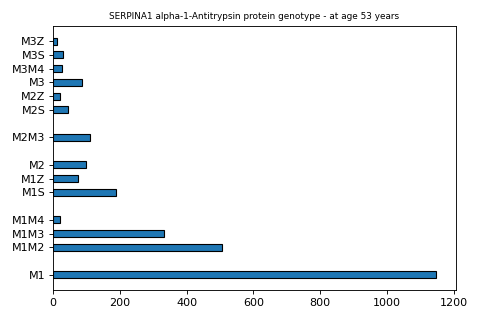

|  | National Survey of Health and Development  |  |
|------------------------------------|---------------------|--------------------------------------|

## Variable Metadata

|  |  |
|:---|:---|
| **Variable** | a1anttr_hbg99 |
| **Field ID** | 31200 |
| **Label** | SERPINA1 alpha-1-Antitrypsin protein genotype - at age 53 years |
| **Card Number** | GEN_HBG |
| **Form** | DNA |
| **Question** | Not applicable |
| **Year** | 1999 |
| **Derived Status** | 1 |
| **Later Version** | NA |
| **Units** | Genotype |
| **Sensitive** | 1 |
| **Reason Public** | NA |
| **Reason Sensitive** | Contains genetic data |
| **Notes** | Plasma sample collected in 1999 (age 53 years) |

## Linked and Longitudinal Variables

There are no associated variables.

## Associated Documents

|  |  |
|:---|:---|
| Questionnaires | [View](https://skylark.ucl.ac.uk/NSHD/exploring/nshd-questionnaires/) |"

## Category Memberships

|  |  |
|:---|:---|
| <a href="#" onclick="this.parentNode.submit()">DNA samples [26]</a> | Legacy Category |
| <a href="#" onclick="this.parentNode.submit()">Genomics [303]</a> | Genomic data derived from blood and saliva assays on the 1946 birth cohort. |

## Value Labels

| Value | Label     |
|:------|:----------|
| -9.0  | Unknown   |
| 1.0   | M1        |
| 10.0  | M2F       |
| 11.0  | M2M3      |
| 12.0  | M2M4      |
| 13.0  | M2S       |
| 14.0  | M2Z       |
| 15.0  | M3        |
| 16.0  | M3M4      |
| 17.0  | M3S       |
| 18.0  | M3Z       |
| 19.0  | M4        |
| 2.0   | M1F       |
| 20.0  | MS=VAR    |
| 21.0  | PP        |
| 22.0  | SF        |
| 23.0  | SS        |
| 24.0  | SZ        |
| 25.0  | ZZ        |
| 3.0   | M1M2      |
| 4.0   | M1M3      |
| 5.0   | M1M4      |
| 6.0   | M1R       |
| 66.0  | No result |
| 7.0   | M1S       |
| 77.0  | No sample |
| 8.0   | M1Z       |
| 9.0   | M2        |

## Frequency Distribution For a1anttr_hbg99

<table
style="width:80%; display:inline-table; border:none; border-style:none; border-collapse:collapse; table-layout:fixed; padding-top:10px; padding-right:10px; padding-bottom:10px; padding-left:10px; margin:2px"
width="80%">
<thead>
<tr
style="border-top-left-radius:10px; -webkit-border-top-left-radius:10px; -moz-border-radius-topleft:10px; border-top-right-radius:10px; -webkit-border-top-right-radius:10px; -moz-border-radius-topright:10px">
<th colspan="2" data-bgcolor="PowderBlue"
style="text-align: center; padding: 7px; word-wrap: break-word; margin: 2px; background-color: PowderBlue; color: black; border: 0;">Frequency
Table</th>
</tr>
</thead>
<tbody>
<tr>
<th></th>
<th></th>
</tr>
<tr>
<th class="skip-filter" data-bgcolor="PowderBlue"
style="text-align: left; padding: 7px; word-wrap: break-word; margin: 2px; background-color: PowderBlue; color: black; border: 0;">Value</th>
<th class="skip-filter" data-bgcolor="PowderBlue"
style="text-align: left; padding: 7px; word-wrap: break-word; margin: 2px; background-color: PowderBlue; color: black; border: 0;">Count</th>
</tr>
&#10;<tr>
<td
style="text-align: left; padding: 5px; border: 0 solid #98A69A; width: 140px; word-wrap: break-word;"
width="140">1.0</td>
<td
style="text-align: left; padding: 5px; border: 0 solid #98A69A; width: 140px; word-wrap: break-word;"
width="140">1148</td>
</tr>
<tr>
<td
style="text-align: left; padding: 5px; border: 0 solid #98A69A; width: 140px; word-wrap: break-word;"
width="140">3.0</td>
<td
style="text-align: left; padding: 5px; border: 0 solid #98A69A; width: 140px; word-wrap: break-word;"
width="140">505</td>
</tr>
<tr>
<td
style="text-align: left; padding: 5px; border: 0 solid #98A69A; width: 140px; word-wrap: break-word;"
width="140">4.0</td>
<td
style="text-align: left; padding: 5px; border: 0 solid #98A69A; width: 140px; word-wrap: break-word;"
width="140">331</td>
</tr>
<tr>
<td
style="text-align: left; padding: 5px; border: 0 solid #98A69A; width: 140px; word-wrap: break-word;"
width="140">5.0</td>
<td
style="text-align: left; padding: 5px; border: 0 solid #98A69A; width: 140px; word-wrap: break-word;"
width="140">21</td>
</tr>
<tr>
<td
style="text-align: left; padding: 5px; border: 0 solid #98A69A; width: 140px; word-wrap: break-word;"
width="140">7.0</td>
<td
style="text-align: left; padding: 5px; border: 0 solid #98A69A; width: 140px; word-wrap: break-word;"
width="140">189</td>
</tr>
<tr>
<td
style="text-align: left; padding: 5px; border: 0 solid #98A69A; width: 140px; word-wrap: break-word;"
width="140">8.0</td>
<td
style="text-align: left; padding: 5px; border: 0 solid #98A69A; width: 140px; word-wrap: break-word;"
width="140">75</td>
</tr>
<tr>
<td
style="text-align: left; padding: 5px; border: 0 solid #98A69A; width: 140px; word-wrap: break-word;"
width="140">9.0</td>
<td
style="text-align: left; padding: 5px; border: 0 solid #98A69A; width: 140px; word-wrap: break-word;"
width="140">98</td>
</tr>
<tr>
<td
style="text-align: left; padding: 5px; border: 0 solid #98A69A; width: 140px; word-wrap: break-word;"
width="140">11.0</td>
<td
style="text-align: left; padding: 5px; border: 0 solid #98A69A; width: 140px; word-wrap: break-word;"
width="140">109</td>
</tr>
<tr>
<td
style="text-align: left; padding: 5px; border: 0 solid #98A69A; width: 140px; word-wrap: break-word;"
width="140">13.0</td>
<td
style="text-align: left; padding: 5px; border: 0 solid #98A69A; width: 140px; word-wrap: break-word;"
width="140">45</td>
</tr>
<tr>
<td
style="text-align: left; padding: 5px; border: 0 solid #98A69A; width: 140px; word-wrap: break-word;"
width="140">14.0</td>
<td
style="text-align: left; padding: 5px; border: 0 solid #98A69A; width: 140px; word-wrap: break-word;"
width="140">20</td>
</tr>
<tr>
<td
style="text-align: left; padding: 5px; border: 0 solid #98A69A; width: 140px; word-wrap: break-word;"
width="140">15.0</td>
<td
style="text-align: left; padding: 5px; border: 0 solid #98A69A; width: 140px; word-wrap: break-word;"
width="140">86</td>
</tr>
<tr>
<td
style="text-align: left; padding: 5px; border: 0 solid #98A69A; width: 140px; word-wrap: break-word;"
width="140">16.0</td>
<td
style="text-align: left; padding: 5px; border: 0 solid #98A69A; width: 140px; word-wrap: break-word;"
width="140">27</td>
</tr>
<tr>
<td
style="text-align: left; padding: 5px; border: 0 solid #98A69A; width: 140px; word-wrap: break-word;"
width="140">17.0</td>
<td
style="text-align: left; padding: 5px; border: 0 solid #98A69A; width: 140px; word-wrap: break-word;"
width="140">29</td>
</tr>
<tr>
<td
style="text-align: left; padding: 5px; border: 0 solid #98A69A; width: 140px; word-wrap: break-word;"
width="140">18.0</td>
<td
style="text-align: left; padding: 5px; border: 0 solid #98A69A; width: 140px; word-wrap: break-word;"
width="140">13</td>
</tr>
<tr
style="border-bottom-left-radius:10px; -webkit-border-bottom-left-radius:10px; -moz-border-radius-bottomleft:10px; border-bottom-right-radius:10px; -webkit-border-bottom-right-radius:10px; -moz-border-radius-bottomright:10px">
<td
style="text-align: left; padding: 5px; border: 0 solid #98A69A; width: 140px; word-wrap: break-word;"
width="140">Series Size</td>
<td
style="text-align: left; padding: 5px; border: 0 solid #98A69A; width: 140px; word-wrap: break-word;"
width="140">2696</td>
</tr>
</tbody>
</table>

## Histogram/Bar chart

