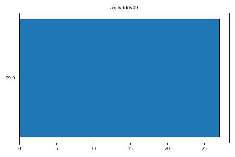

<table
style="width:90%; display:inline-table; border:0; border-style:none; border-collapse:collapse"
width="90%">
<colgroup>
<col style="width: 100%" />
</colgroup>
<tbody>
<tr>
<td style="padding: 10px; border: 0; width: 140px" width="140">

<h1 id="mrc-national-survey-of-health-and-development"
style="color:black; font-size:2vw; display:inline; float:left">  MRC
National Survey of Health and Development  </h1>

</td>
</tr>
<tr>
<td></td>
</tr>
</tbody>
</table>

## Variable Metadata

|  |  |
|:---|:---|
| **Variable** | anplvdddv09 |
| **Field ID** | 14448 |
| **Label** | Date of discharge, (Angioplasty) (Day) - Hospital validation - at 60-64 years |
| **Card Number** | HospAdmitValid09 |
| **Form** | Postal questionnaire |
| **Question** | 21(c) |
| **Year** | 2006-10 |
| **Derived Status** | 1 |
| **Later Version** | NA |
| **Units** | day |
| **Sensitive** | 1 |
| **Reason Public** | NA |
| **Reason Sensitive** | Contains the day information about the date |
| **Notes** | Self-reported hospital admission (HA) data from the 2006-10 postal questionnaire were validated against hospital records. |

## Linked and Longitudinal Variables

There are no associated variables.

## Associated Documents

|  |  |
|:---|:---|
| Questionnaires | <a href="https://skylark.ucl.ac.uk/NSHD/exploring/nshd-questionnaires/"
target="_blank">View</a> |

## Category Memberships

|  |  |
|:---|:---|
| <a href="#" onclick="this.parentNode.submit()">Hospital admissions
[10]</a> | Legacy Category |
| <a href="#" onclick="this.parentNode.submit()">Hospital admissions
validated against hospital records [510613]</a> | This category contains data from the questionnaires on all self-reported hospital admitted patient validated against hospital records at age 60-64 years. |

## Value Labels

| Value | Label   |
|:------|:--------|
| 99.0  | Unknown |

## Frequency Distribution For anplvdddv09

## Histogram/Bar chart

## Histogram/Plot

Missing values have been removed and low cell counts excluded.