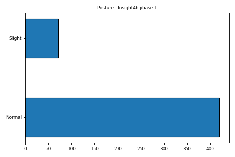

|  | National Survey of Health and Development  |  |
|------------------------------------|---------------------|--------------------------------------|

## Variable Metadata

|  |  |
|:---|:---|
| **Variable** | updrs_posture_3_12_i46p1 |
| **Field ID** | [60610](https://datashare.ndph.ox.ac.uk/nshd46/field.cgi?id=60610) |
| **Label** | Posture - Insight46 phase 1 |
| **Card Number** | I46_UPDRS |
| **Form** | Insight46 - Phase 1 |
| **Question** | 3.13 |
| **Year** | 2015-2018 |
| **Derived Status** | 0 |
| **Later Version** | NA |
| **Units** | Not applicable |
| **Sensitive** | 0 |
| **Reason Public** | NA |
| **Reason Sensitive** | NA |
| **Notes** | Insight46 phase 1 Unified Parkinson's Disease Rating Scale (UPDRS) Part III: Motor examination. Repeated in phase 2 - see library file I46P2_UPDRS. |

## Linked and Longitudinal Variables

| Variable | Description | Year | Form | Question | Library File |
|:---|:---|:---|:---|:---|:---|
| [updrs_posture_3_12_i46p2](https://github.com/rmjdish/test/wiki/updrs_posture_3_12_i46p2) | Posture - Insight46 phase 2 | 2018-2021 | Insight46 - Phase 2 | 3.13 | I46P2_UPDRS |

## Associated Documents

|  |  |
|:---|:---|
| Questionnaires | [View](https://skylark.ucl.ac.uk/NSHD/exploring/nshd-questionnaires/) |"

## Category Memberships

|  |  |
|:---|:---|
| Unified Parkinson's Disease Rating Scale (UPDRS) \[60353\] | This category contains information on the Unified Parkinson's Disease Rating Scale (UPDRS) in the Insight46 sub-study. |

## Value Labels

| Value | Label  |
|:------|:-------|
| 0.0   | Normal |
| 1.0   | Slight |

## Frequency Distribution For updrs_posture_3_12_i46p1

<table
style="width:80%; display:inline-table; border:none; border-style:none; border-collapse:collapse; table-layout:fixed; padding-top:10px; padding-right:10px; padding-bottom:10px; padding-left:10px; margin:2px"
width="80%">
<thead>
<tr
style="border-top-left-radius:10px; -webkit-border-top-left-radius:10px; -moz-border-radius-topleft:10px; border-top-right-radius:10px; -webkit-border-top-right-radius:10px; -moz-border-radius-topright:10px">
<th colspan="2" data-bgcolor="PowderBlue"
style="text-align: center; padding: 7px; word-wrap: break-word; margin: 2px; background-color: PowderBlue; color: black; border: 0;">Frequency
Table</th>
</tr>
</thead>
<tbody>
<tr>
<th></th>
<th></th>
</tr>
<tr>
<th class="skip-filter" data-bgcolor="PowderBlue"
style="text-align: left; padding: 7px; word-wrap: break-word; margin: 2px; background-color: PowderBlue; color: black; border: 0;">Value</th>
<th class="skip-filter" data-bgcolor="PowderBlue"
style="text-align: left; padding: 7px; word-wrap: break-word; margin: 2px; background-color: PowderBlue; color: black; border: 0;">Count</th>
</tr>
&#10;<tr>
<td
style="text-align: left; padding: 5px; border: 0 solid #98A69A; width: 140px; word-wrap: break-word;"
width="140">0.0</td>
<td
style="text-align: left; padding: 5px; border: 0 solid #98A69A; width: 140px; word-wrap: break-word;"
width="140">420</td>
</tr>
<tr>
<td
style="text-align: left; padding: 5px; border: 0 solid #98A69A; width: 140px; word-wrap: break-word;"
width="140">1.0</td>
<td
style="text-align: left; padding: 5px; border: 0 solid #98A69A; width: 140px; word-wrap: break-word;"
width="140">71</td>
</tr>
<tr
style="border-bottom-left-radius:10px; -webkit-border-bottom-left-radius:10px; -moz-border-radius-bottomleft:10px; border-bottom-right-radius:10px; -webkit-border-bottom-right-radius:10px; -moz-border-radius-bottomright:10px">
<td
style="text-align: left; padding: 5px; border: 0 solid #98A69A; width: 140px; word-wrap: break-word;"
width="140">Series Size</td>
<td
style="text-align: left; padding: 5px; border: 0 solid #98A69A; width: 140px; word-wrap: break-word;"
width="140">491</td>
</tr>
</tbody>
</table>
Statistics relate to plotted values only.

## Histogram/Bar chart

Missing values have been removed and low cell counts excluded.